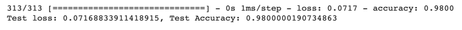
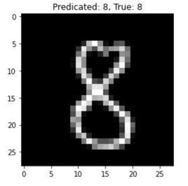

# Python Neural Network labs
Python implementation of MNIST and CIFAR10 neural networks

## Installation

Python, Matplot, Numpy, TensorFlow, Keras 
>sudo apt install python3-pip 
pip3 install numpy 
pip3 install tensorflow 
pip3 install matplotlib 

## Execution

> python3 main.py 

(will changed in te future)

## Current status:
### - MNIST
Status: **Working**

Performance:

Working Example

 
 
 

### - CIFAR10
Status: **Not Working**
